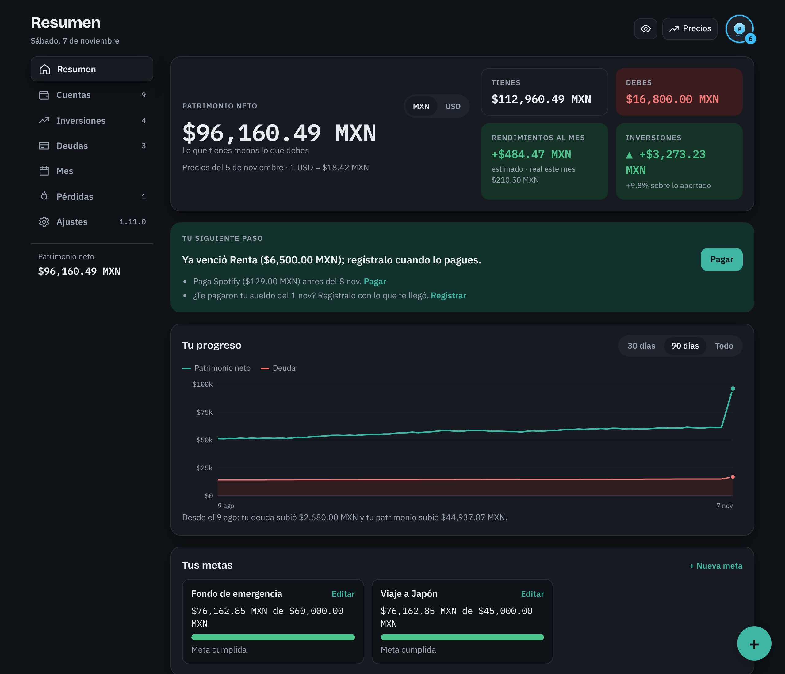

  

<h1 align="center">Cuentas Claras</h1>

<strong>Pesos, dólares y cripto en un solo lugar.</strong> 
Tus cuentas, inversiones, deudas y gastos del mes, claros. Para Android y Windows.

  <a href="https://github.com/jeanskull/CuentasClaras-release/releases/download/v1.14.0-ensayo/CuentasClaras_1.14.0_android.apk"><strong>Descargar para Android</strong></a>
  &nbsp;·&nbsp;
  <a href="https://github.com/jeanskull/CuentasClaras-release/releases/download/v1.14.0-ensayo/Cuentas.Claras_1.14.0_x64-setup.exe"><strong>Descargar para Windows</strong></a>
  &nbsp;·&nbsp;
  <a href="https://github.com/jeanskull/CuentasClaras-release/releases">Todas las versiones</a>

Versión de prueba 1.14.0 · Android 7 o superior · Windows 10 y 11 (64 bits)

  

## Qué puedes hacer

- **Cuentas por app** (banco, exchange, casa de bolsa o billetera) con rendimientos, topes y metas de ahorro.
- **Inversiones y bots** con capital aportado, ciclos, cierre y ganancia realizada.
- **Deudas** con intereses, pagos a meses, próximos pagos y un plan para liquidarlas.
- **Mes**: ingresos, gastos por categoría con límites, gastos fijos y sueldo.
- **Precios al día**: el dólar y tus criptos se actualizan solos.
- **Niveles y rangos compartidos con Hito:** subes por hábitos (registrar, pagar a tiempo, cumplir metas), nunca por cuánto dinero tienes. Cada rango nuevo se revela con una celebración.
- **Funciona sin conexión.** Tus datos se guardan en tu dispositivo y la app hace un respaldo automático cada semana.

  

## Instalar en Android

1. Abre en tu celular el enlace **Descargar para Android** y descarga el archivo `.apk`.
2. Ábrelo desde las notificaciones o desde la carpeta Descargas.
3. Si Android pide permiso para *instalar apps de fuentes desconocidas*, actívalo para tu navegador o para «Archivos» y vuelve atrás.
4. Si aparece Google Play Protect, elige **Más detalles → Instalar de todas formas**. Aparece porque la app todavía no se distribuye por Play Store.
5. Toca **Instalar** y abre Cuentas Claras.

## Instalar en Windows

1. Descarga el instalador con el enlace **Descargar para Windows**.
2. Ábrelo. Si Windows muestra *«Windows protegió tu PC»*, elige **Más información → Ejecutar de todas formas**. El aviso sale porque el instalador aún no tiene un certificado comercial de editor.
3. Sigue los pasos del instalador y abre Cuentas Claras desde el menú Inicio.

## Actualizaciones

Cuentas Claras te avisa dentro de la app cuando hay una versión nueva, en **Ajustes → Acerca de**. La descarga se verifica antes de instalarse y tus datos se conservan.

## Tus datos

- Todo se guarda **solo en tu dispositivo**. No necesitas cuenta.
- Cada semana la app guarda una copia de seguridad automática: en Windows en *Documentos\Cuentas Claras\Respaldos*, y en Android 10 o superior en *Descargas/Cuentas Claras*. También puedes descargar un respaldo cuando quieras desde Ajustes.
- Para consultar precios, la app solo descarga el tipo de cambio y los precios públicos de criptos; no envía nada tuyo.

## Novedades de la 1.14.0

**Agregado**

- Editar transferencias y abonos: toca uno en Mes → «Editar» para corregir lo que salió, lo que llegó, la fecha o la nota. Los saldos de las dos cuentas (o la deuda) se ajustan solos por la diferencia. Para cambiar las cuentas, se borra y se captura de nuevo.
- Gasto dividido entre categorías: al agregar un gasto, «Dividir entre varias categorías» reparte el monto (por ejemplo, $300 del súper: $200 en Comida y $100 en Hogar). Cada parte cuenta en su categoría y en sus límites, y la cuenta baja una sola vez por el total. En Mes se marcan como «dividido».
- Deudas: deslizador para elegir el abono, con atajos «Mínimo», «Mitad» y «Todo».

**Mejorado**

- Las gráficas (tu progreso, el crecimiento de cada banco y los ciclos de un bot) ahora son curvas suaves. Pasan exactamente por cada dato y nunca dibujan subidas ni bajadas que no pasaron.
- En las cifras grandes (patrimonio, totales de Cuentas y Deudas) los centavos se ven más chicos, para leer primero los pesos.
- Cuentas: la barra de colores ahora tiene leyenda: qué color es cada banco o exchange y cuánto pesa.
- Mientras se cargan tus datos se ven siluetas en lugar de «$0.00» y listas vacías.

**Corregido**

- Un rango nuevo ya no se adelanta: el botón de tu perfil se queda con tu rango anterior hasta que ves la celebración. Funciona igual en las tres apps.

## Novedades de la 1.13.1

**Agregado**

- Reliquia, la nueva app de la familia (tus logros de juegos convertidos en cartas), ya suma EXP a tu nivel. En tu perfil, «Tu EXP» muestra cuánto viene de Hito, de Cuentas Claras y de Reliquia.
- Logro nuevo de la familia: «La familia completa», por ganar EXP en las tres apps.

**Corregido**

- «Sumar intereses» en una cuenta: si elegías otra fecha (por ejemplo el día 12 estando en el 14), a veces el interés quedaba con la fecha de hoy, porque la lista se volvía a dibujar y regresaba la fecha a hoy antes de guardar. Ahora la fecha y el monto que escribes se conservan hasta que tocas «Sumar intereses».

Desde la app puedes ver el historial completo en **Ajustes → Acerca de → Registro de cambios**.

---

Creado por <strong>JeanSkull</strong> · Desarrollado con la ayuda de Claude

